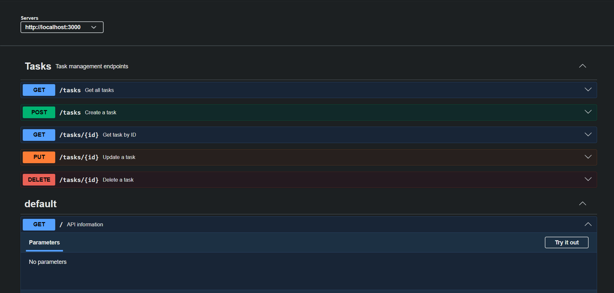

# Task API

A simple RESTful Task API built with **Express.js**. It supports creating, reading, updating, and deleting tasks (CRUD) and includes interactive API documentation using **Swagger UI**.

## Features

- Create, read, update, and delete tasks
- JSON request and response format
- Input validation
- Health check endpoint
- Interactive API documentation with Swagger

---

## Tech Stack

- Node.js
- Express.js
- Swagger UI
- OpenAPI 3.0

---

## Installation

### Clone the repository

```bash
git clone https://github.com/rishit-kadha/Flyrank_w2_a1.git
cd Flyrank_w2_a1
```

### Install dependencies

```bash
npm install
```

### Run the server

```bash
npm start
```

The server will start on:

```
http://localhost:3000
```

Swagger documentation is available at:

```
http://localhost:3000/docs
```

---

# API Endpoints

| Method | Endpoint     | Description             |
| ------ | ------------ | ----------------------- |
| GET    | `/`          | API information         |
| GET    | `/health`    | Health check            |
| GET    | `/tasks`     | Get all tasks           |
| GET    | `/tasks/:id` | Get a task by ID        |
| POST   | `/tasks`     | Create a new task       |
| PUT    | `/tasks/:id` | Update an existing task |
| DELETE | `/tasks/:id` | Delete a task           |

---

# Example Request

Create a task:

Curl

```bash
curl -X 'POST' \
  'http://localhost:3000/tasks' \
  -H 'accept: application/json' \
  -H 'Content-Type: application/json' \
  -d '{
  "title": "Learn Swagger"
}'
```

Request URL
`http://localhost:3000/tasks`

Example output:

Response body

```http
{
  "id": 6,
  "title": "Learn Swagger",
  "done": false
}
```

Response headers

```http
 connection: keep-alive
 content-length: 45
 content-type: application/json; charset=utf-8
 date: Sat,18 Jul 2026 09:53:51 GMT
 etag: W/"2d-iG6dyqFqh3zXS/edjRDt5NaiLWY"
 keep-alive: timeout=5
 x-powered-by: Express
```

---

# Swagger Documentation

Interactive API documentation is available at:

```
http://localhost:3000/docs
```



---

# Project Structure

```
.
├── swagger.json
├── index.js
├── package.json
├── package-lock.json
└── README.md
```

---

# License

This project was created for learning purposes.
